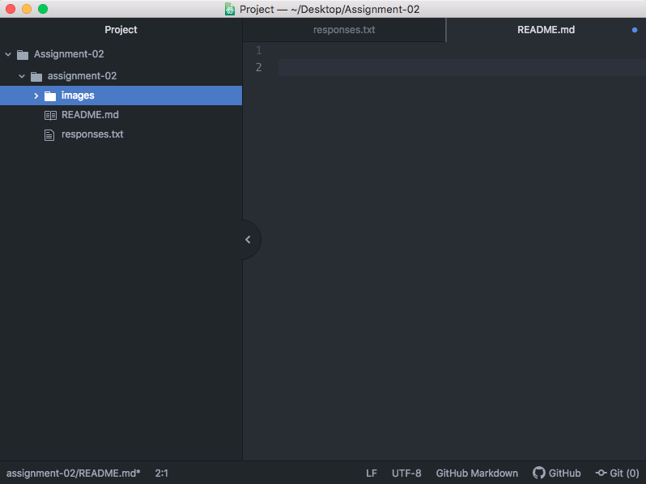

# Assignment-02
## Caroline E. Gancarz

Hi there! I really wanted to take this class at UMT because I feel as though I have a general lack of computer knowledge. I am not "hip" nor technologically advanced when it comes to any sort of development, so I thought "what the hay, time to learn something new and useful!" I do believe there is a better way of learning web development than stooping to the level of using basic websites that charge you for unoriginal design/content management. I am hoping to use my skills learned in this class to develop a better understanding of all it takes to create basic websites, what makes them good, and how to better market myself for a changing economy. Thanks for having me! :)

A list of what I've learned thus far:

- homework should be started as soon as possible
- procrastinating until the day of (in life/school/whatever aspect) is generally not a benefit to ANYONE
- the actual process of getting your thoughts/ideas onto the screen is actually rewarding

[Reddit.com/r/funny](https://www.reddit.com/r/funny/)

[My Responses File](./responses.txt)

