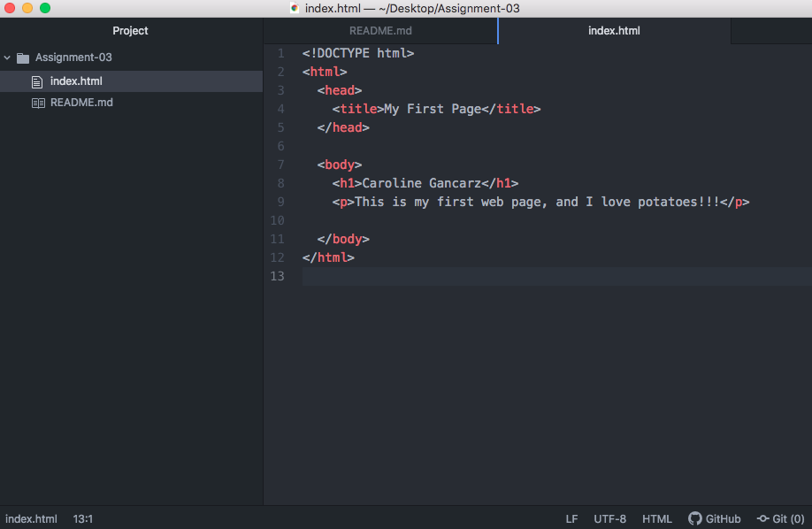

Homework for Assignment-03

1) Web browsers function as applications to access the internet. Browsers access web pages via URL identification from a server to give the browser's user access they are seeking. I personally used to use Opera as my prior web browser, but currently use Chrome for my browsing needs.

2) Markup language is used by computers to decipher commands within a document. This language is understood by humans because it uses laments terms to describe tasks versus programming syntax. Two common markup languages are HTML (which we are learning)and XML.

