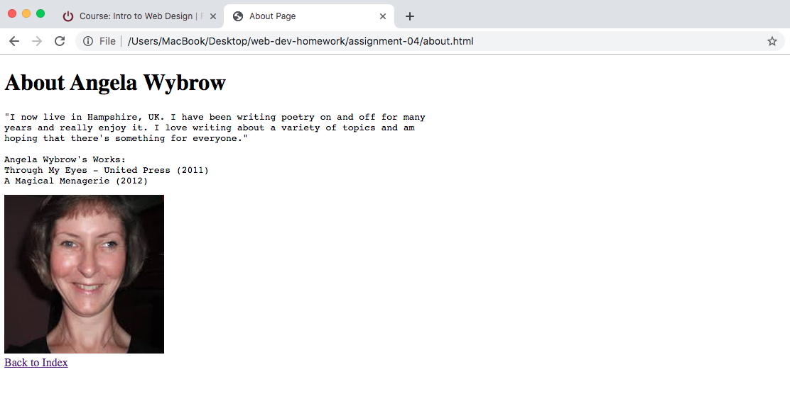

# Assignment-04
## Caroline Gancarz

1. Using the Wayback Machine, I realized Buzzfeed has always, and still is, filled with "articles" that make me lose faith in Humanity. The first Title that appeared on screen from May 11, 2007 was titled "I Hate Crocs: The world's favorite sweaty sandals get their very own hate site" and I am completely in awe that this website still exists. Who needs a quiz to know what kind of cheese they are?! ... Okay, I can understand the wacky pull it has on people who had nothing better to do than sit on their 1K$ cellphones looking at memes and cat photos, but still... The website appears to have gone from an easy format with an endless scroll bar for more "articles" to brighter colors, increasingly ridiculous photos accompanied by eccentric headlines, and more contributing writers. Today, it appears that Buzzfeed has underneath it all, changed very little; the goal is still to gain followers, entice readers, and waste peoples' time. 

2. My experience using GIT module has been eye opening and very helpful! This application feels as though learning html language is not too bad! I was intimidated at first skipping around, making sure things were done in correct sequence, but now I feel more confident in my actions and can actually see the results firsthand. This is great!

Anywho, here is the screenshot you are looking for!
 

